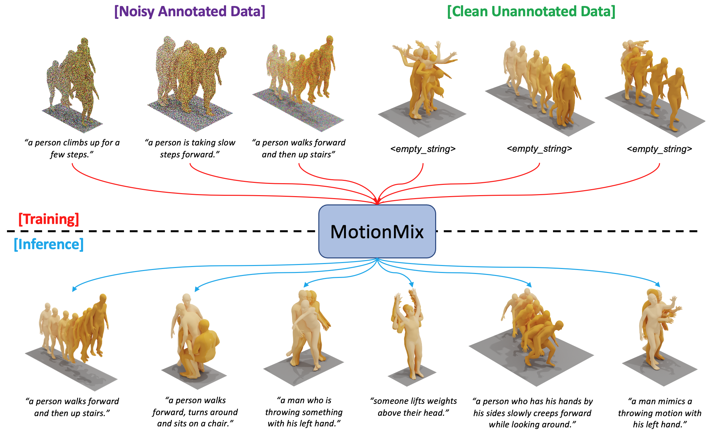

[](https://arxiv.org/abs/2401.11115)
[](https://nhathoang2002.github.io/MotionMix-page/)


<div align="center">


<h1>MotionMix: Weakly-Supervised Diffusion for Controllable Motion Generation</h1>
<div>
    <a href='https://nhathoang2002.github.io/' target='_blank'>Nhat M. Hoang</a><sup>1,2</sup>*&emsp;
    <a>Gong Kehong</a><sup>2+</sup>&emsp;
    <a href='https://ericguo5513.github.io/' target='_blank'>Chuan Guo</a><sup>2*</sup>&emsp;
    <a>Michael Bi Mi</a><sup>2</sup>&emsp;
</div>
<div>
    <sup>1</sup>Nanyang Technological University&emsp;
    <sup>2</sup>Huawei Technologies Co., Ltd&emsp;
</div>
<div>
    <sup>*</sup>Work done while interning at Huawei
    <sup>+</sup>Corresponding author
</div>



This repository contains the official implementation of *MotionMix: Weakly-Supervised Diffusion for Controllable Motion Generation*.
<br>
Please refer to our [project page](https://nhathoang2002.github.io/MotionMix-page/) for more visualizations.

</div>


## Updates

[02/2024] Release training and inference code for the model MDM (text-to-motion, action-to-motion),  MotionDiffuse (text-to-motion), and EDGE (music-to-dance).

[01/2024] [Paper](https://arxiv.org/abs/2401.11115) uploaded to arXiv.

[12/2023] Paper accepted at **AAAI-24 Main Track**! 🎉

## Development

This is a research implementation and, in general, will not be regularly updated or maintained long after release.

## Citation

If you find our work useful for your research and development, please consider citing the paper:

```
@misc{hoang2024motionmix,
  title={MotionMix: Weakly-Supervised Diffusion for Controllable Motion Generation}, 
  author={Nhat M. Hoang and Kehong Gong and Chuan Guo and Michael Bi Mi},
  year={2024},
  eprint={2401.11115},
  archivePrefix={arXiv},
  primaryClass={cs.CV}
}
```
