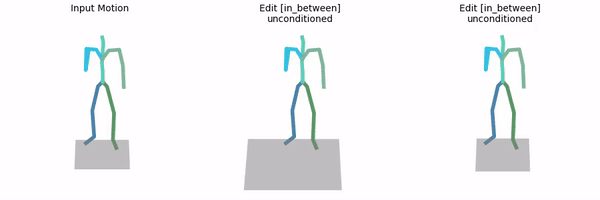

# MDM: Human Motion Diffusion Model

## Getting started

This code was tested on `Ubuntu 18.04.5 LTS`, `Ubuntu 22.04.03 LTS and requires:

* Python 3.7
* conda3 or miniconda3
* CUDA capable GPU (one is enough)

### 1. Setup environment

Install ffmpeg (if not already installed):

```shell
sudo apt update
sudo apt install ffmpeg
```

Setup conda env:
```shell
conda env create -f environment.yml
conda activate mdm
python -m spacy download en_core_web_sm
pip install git+https://github.com/openai/CLIP.git
```

Download dependencies:

<details>
  <summary><b>Text to Motion</b></summary>

```bash
bash prepare/download_smpl_files.sh
bash prepare/download_glove.sh
bash prepare/download_t2m_evaluators.sh
```
</details>

<details>
  <summary><b>Action to Motion</b></summary>

```bash
bash prepare/download_smpl_files.sh
bash prepare/download_recognition_models.sh
```
</details>

### 2. Get data

<details>
  <summary><b>Text to Motion</b></summary>

There are two paths to get the data:

(a) **Go the easy way if** you just want to generate text-to-motion (excluding editing which does require motion capture data)

(b) **Get full data** to train and evaluate the model.


#### a. The easy way (text only)

**HumanML3D** - Clone HumanML3D, then copy the data dir to our repository:

```shell
cd ..
git clone https://github.com/EricGuo5513/HumanML3D.git
unzip ./HumanML3D/HumanML3D/texts.zip -d ./HumanML3D/HumanML3D/
cp -r HumanML3D/HumanML3D motion-diffusion-model/dataset/HumanML3D
cd motion-diffusion-model
```


#### b. Full data (text + motion capture)

**HumanML3D** - Follow the instructions in [HumanML3D](https://github.com/EricGuo5513/HumanML3D.git),
then copy the result dataset to our repository:

```shell
cp -r ../HumanML3D/HumanML3D ./dataset/HumanML3D
```

**KIT** - Download from [HumanML3D](https://github.com/EricGuo5513/HumanML3D.git) (no processing needed this time) and the place result in `./dataset/KIT-ML`
</details>

<details>
  <summary><b>Action to Motion</b></summary>

**UESTC, HumanAct12** 
```bash
bash prepare/download_a2m_datasets.sh
```
</details>


### 3. Download the pretrained models

Download the model(s) you wish to use, then unzip and place them in `./save/`. 

<details>
  <summary><b>Text to Motion</b></summary>

| Model | Link |
| --- | --- |
| mdm_baseline_ml3d | [link](https://drive.google.com/file/d/1PE0PK8e5a5j-7-Xhs5YET5U5pGh0c821/view?usp=sharing) |
| motionmix_ml3d_lower20_upper60_ratio50_pivot60 | Link (TBC) |
| mdm_baseline_kit | [link](https://drive.google.com/file/d/1SHCRcE0es31vkJMLGf9dyLe7YsWj7pNL/view?usp=sharing) |
| motionmix_kit_lower20_upper40_ratio50_pivot40 | Link (TBC) |


</details>

<details>
  <summary><b>Action to Motion</b></summary>

| Model | Link |
| --- | --- |
| mdm_baseline_humanact12 | [link](https://drive.google.com/file/d/154X8_Lgpec6Xj0glEGql7FVKqPYCdBFO/view?usp=sharing) |
| motionmix_humanact12_lower10_upper30_ratio50_pivot30 | Link (TBC) |
| mdm_baseline_uestc | [link](https://drive.google.com/file/d/1goB2DJK4B-fLu2QmqGWKAqWGMTAO6wQ6/view?usp=sharing) |
| motionmix_uestc_lower10_upper30_ratio50_pivot30 | Link (TBC) |

</details>


## Motion Synthesis
<details>
  <summary><b>Text to Motion</b></summary>

### Generate from test set prompts

```shell
# Baseline
python -m sample.generate --model_path ./save/humanml_trans_enc_512/model000200000.pt --num_samples 10 --num_repetitions 3

# MotionMix
python -m sample.generate --model_path ./save/motionmix_ml3d_lower20_upper60_ratio50_pivot60/model000200000.pt --num_samples 10 --num_repetitions 3 --mask_at_time 60
```

### Generate from your text file

```shell
# Baseline
python -m sample.generate --model_path ./save/humanml_trans_enc_512/model000200000.pt --input_text ./assets/example_text_prompts.txt

# MotionMix
python -m sample.generate --model_path ./save/motionmix_ml3d_lower20_upper60_ratio50_pivot60/model000200000.pt --input_text ./assets/example_text_prompts.txt --mask_at_time 60
```

### Generate a single prompt

```shell
python -m sample.generate --model_path ./save/humanml_trans_enc_512/model000200000.pt --text_prompt "the person walked forward and is picking up his toolbox."

# MotionMix
python -m sample.generate --model_path ./save/motionmix_ml3d_lower20_upper60_ratio50_pivot60/model000200000.pt --text_prompt "the person walked forward and is picking up his toolbox." --mask_at_time 60
```
</details>

<details>
  <summary><b>Action to Motion</b></summary>

### Generate from test set actions

```shell
# Baseline
python -m sample.generate --model_path ./save/humanact12/model000350000.pt --num_samples 10 --num_repetitions 3

# MotionMix
python -m sample.generate --model_path ./save/motionmix_humanact12_lower10_upper30_ratio50_pivot30/model000350000.pt --num_samples 10 --num_repetitions 3 --mask_at_time 30
```

### Generate from your actions file

```shell
# Baseline
python -m sample.generate --model_path ./save/humanact12/model000350000.pt --action_file ./assets/example_action_names_humanact12.txt

# MotionMix
python -m sample.generate --model_path ./save/motionmix_humanact12_lower10_upper30_ratio50_pivot30/model000350000.pt --action_file ./assets/example_action_names_humanact12.txt --mask_at_time 30
```

### Generate a single action

```shell
# Baseline
python -m sample.generate --model_path ./save/humanact12/model000350000.pt --action_name "drink"

# Baseline
python -m sample.generate --model_path ./save/motionmix_humanact12_lower10_upper30_ratio50_pivot30/model000700000.pt --action_name "drink" --mask_at_time 30
```
</details>

**You may also define:**
* `--device` id.
* `--seed` to sample different prompts.
* `--motion_length` (text-to-motion only) in seconds (maximum is 9.8[sec]).
* `--mask_at_time`: introduced argument for MotionMix's inference, which is the time step to hide the guidance condition. We use the same value with the denoising pivot `--t_noise_pivot` during training.


**Running those will get you:**

* `results.npy` file with text prompts and xyz positions of the generated animation
* `sample##_rep##.mp4` - a stick figure animation for each generated motion.

It will look something like this:


You can stop here, or render the SMPL mesh using the following script.

### Render SMPL mesh

To create SMPL mesh per frame run:

```shell
python -m visualize.render_mesh --input_path /path/to/mp4/stick/figure/file
```

**This script outputs:**
* `sample##_rep##_smpl_params.npy` - SMPL parameters (thetas, root translations, vertices and faces)
* `sample##_rep##_obj` - Mesh per frame in `.obj` format.

**Notes:**
* The `.obj` can be integrated into Blender/Maya/3DS-MAX and rendered using them.
* This script is running [SMPLify](https://smplify.is.tue.mpg.de/) and needs GPU as well (can be specified with the `--device` flag).
* **Important** - Do not change the original `.mp4` path before running the script.

**Notes for 3d makers:**
* You have two ways to animate the sequence:
  1. Use the [SMPL add-on](https://smpl.is.tue.mpg.de/index.html) and the theta parameters saved to `sample##_rep##_smpl_params.npy` (we always use beta=0 and the gender-neutral model).
  1. A more straightforward way is using the mesh data itself. All meshes have the same topology (SMPL), so you just need to keyframe vertex locations. 
     Since the OBJs are not preserving vertices order, we also save this data to the `sample##_rep##_smpl_params.npy` file for your convenience.

## Motion Editing

* This feature is available for text-to-motion datasets (HumanML3D and KIT).
* In order to use it, you need to acquire the full data (not just the texts).
* We support the two modes presented in the paper: `in_between` and `upper_body`.

### Unconditioned editing

```shell
# Baseline
python -m sample.edit --model_path ./save/humanml_trans_enc_512/model000200000.pt --edit_mode in_between

# MotionMix
python -m sample.edit --model_path ./save/motionmix_ml3d_lower20_upper60_ratio50_pivot60/model000200000.pt --edit_mode in_between --mask_at_time 60
```

**You may also define:**
* `--num_samples` (default is 10) / `--num_repetitions` (default is 3).
* `--device` id.
* `--seed` to sample different prompts.
* `--edit_mode upper_body` For upper body editing (lower body is fixed).
* `--mask_at_time`: introduced argument for MotionMix's inference, which is the time step to hide the guidance condition. We use the same value with the denoising pivot `--t_noise_pivot` during training.


The output will look like this (blue frames are from the input motion; orange were generated by the model):



* As in *Motion Synthesis*, you may follow the **Render SMPL mesh** section to obtain meshes for your edited motions.

### Text conditioned editing

Just add the text conditioning using `--text_condition`. For example:

```shell
# Baseline
python -m sample.edit --model_path ./save/humanml_trans_enc_512/model000200000.pt --edit_mode upper_body --text_condition "A person throws a ball"

# MotionMix
python -m sample.edit --model_path ./save/motionmix_ml3d_lower20_upper60_ratio50_pivot60/model000200000.pt --edit_mode upper_body --text_condition "A person throws a ball" --mask_at_time 60
```

The output will look like this (blue joints are from the input motion; orange were generated by the model):


## Train your own MDM

In addition to the original training pipeline, we have modified the code to allow multi-gpu training with PyTorch Distributed Data Parallel (DDP).

<details>
  <summary><b>Text to Motion</b></summary>

**HumanML3D**
```shell
# Baseline
python -m train.train_mdm --save_dir save/my_humanml_trans_enc_512 --dataset humanml

# MotionMix (1-gpu)
python -m train.train_mdm --save_dir save/motionmix_ml3d_lower20_upper60_ratio50_pivot60 --dataset humanml --t_noise_lower 20 --t_noise_upper 60 --noisy_ratio 0.5 --t_noise_pivot 60 --use_unlabeled_clean

# MotionMix (2-gpu or more)
python -m torch.distributed.launch --nproc_per_node=2 -m train.train_mdm --save_dir save/motionmix_ml3d_lower20_upper60_ratio50_pivot60 --dataset humanml --t_noise_lower 20 --t_noise_upper 60 --noisy_ratio 0.5 --t_noise_pivot 60 --use_unlabeled_clean --distributed
```

**KIT**
```shell
# Baseline
python -m train.train_mdm --save_dir save/my_kit_trans_enc_512 --dataset kit

# MotionMix (1-gpu)
python -m train.train_mdm --save_dir save/motionmix_kit_lower20_upper40_ratio50_pivot40 --dataset kit --t_noise_lower 20 --t_noise_upper 40 --noisy_ratio 0.5 --t_noise_pivot 40 --use_unlabeled_clean

# MotionMix (2-gpu or more)
python -m torch.distributed.launch --nproc_per_node=2 -m train.train_mdm --save_dir save/motionmix_kit_lower20_upper40_ratio50_pivot40 --dataset kit --t_noise_lower 20 --t_noise_upper 40 --noisy_ratio 0.5 --t_noise_pivot 40 --use_unlabeled_clean --distributed
```

</details>
<details>
  <summary><b>Action to Motion</b></summary>

```shell
# Baseline
python -m train.train_mdm --save_dir save/my_name --dataset {humanact12,uestc} --cond_mask_prob 0 --lambda_rcxyz 1 --lambda_vel 1 --lambda_fc 1

# MotionMix (1-gpu)
python -m train.train_mdm --save_dir save/my_name --dataset {humanact12,uestc} --cond_mask_prob 0 --lambda_rcxyz 1 --lambda_vel 1 --lambda_fc 1 --t_noise_lower 10 --t_noise_upper 30 --noisy_ratio 0.5 --t_noise_pivot 30 --use_unlabeled_clean

# MotionMix (2-gpu or more)
python -m torch.distributed.launch --nproc_per_node=2 -m train.train_mdm --save_dir save/my_name --dataset {humanact12,uestc} --cond_mask_prob 0 --lambda_rcxyz 1 --lambda_vel 1 --lambda_fc 1 --t_noise_lower 10 --t_noise_upper 30 --noisy_ratio 0.5 --t_noise_pivot 30 --use_unlabeled_clean --distributed
```
</details>

Optional arguments:
* `--device` to define GPU id (for 1-gpu training).
* `--arch` to choose one of the architectures reported in the paper `{trans_enc, trans_dec, gru}` (`trans_enc` is default).
* `--train_platform_type {ClearmlPlatform, TensorboardPlatform}` to track results with either [ClearML](https://clear.ml/) or [Tensorboard](https://www.tensorflow.org/tensorboard).
* `--eval_during_training` to run a short (90 minutes) evaluation for each saved checkpoint. 
  This will slow down training but will give you better monitoring.

Introduced arguments for MotionMix's training, including:
- `--t_noise_lower`: the lower bound $T_1$ of the noisy range $[T_1, T_2]$ in the paper
- `--t_noise_upper`: the upper bound $T_2$ of the noisy range $[T_1, T_2]$ in the paper
- `--t_noise_pivot`: the denoising pivot $T^*$ in the paper
- `--noisy_ratio`: the ratio of noisy samples in the training set, we use 50% as in the paper
- `--use_unlabeled_clean`: whether to hide the guidance annotation for the clean samples or not

## Evaluate

<details>
  <summary><b>Text to Motion</b></summary>

* Takes about 20 hours (on a single GPU)
* The output of this script for the pre-trained models (as was reported in the paper) is provided in the checkpoints zip file.

```shell
# Baseline
python -m eval.eval_humanml --model_path <path-to-model-ckpt> --eval_mode {debug,wo_mm,mm_short} --dataset {humanml,kit}

# MotionMix
python -m eval.eval_humanml --model_path <path-to-model-ckpt> --dataset {humanml,kit} --eval_mode {debug,wo_mm,mm_short} --mask_at_time <denoising_pivot>
```

</details>

<details>
  <summary><b>Action to Motion</b></summary>

* Takes about 7 hours for UESTC and 2 hours for HumanAct12 (on a single GPU)
* The output of this script for the pre-trained models (as was reported in the paper) is provided in the checkpoints zip file.

```shell
# Baseline
python -m eval.eval_humanact12_uestc --model <path-to-model-ckpt> --eval_mode {debug,full}

# MotionMix
python -m eval.eval_humanact12_uestc --model <path-to-model-ckpt> --dataset humanact12 --eval_mode {debug,full} --mask_at_time <denoising_pivot>
```
where `path-to-model-ckpt` can be a path to any of the pretrained action-to-motion models listed above, or to a checkpoint trained by the user.

</details>

**You may also define:**
* `--device` id.
* `--mask_at_time`: introduced argument for MotionMix's inference, which is the time step to hide the guidance condition. We use the same value with the denoising pivot `--t_noise_pivot` during training.

## Acknowledgments

This code is developed on top of [MDM: Human Motion Diffusion Model
](https://github.com/GuyTevet/motion-diffusion-model) with the following major modifications:
- Class [`Text2MotionDatasetV2`](data_loaders/humanml/data/dataset.py#L280) (for text-to-motion), classes [`HumanAct12Poses`](data_loaders/a2m/humanact12poses.py#L27) and [`UESTC`](data_loaders/a2m/uestc.py#L112) (for action-to-motion):
    - Split the dataset into two subsets based on `--noisy_ratio`;
    - Approximate one subset to be noisy based on `--t_noise_lower`, `--t_noise_upper`;
    - Hide the guidance condition for the clean subset based on `--use_unlabeled_clean`.
    - **Note**: for action-to-motion, we split the dataset equally among the action classes.
- Method [`ScheduleSampler.sample()`](diffusion/resample.py#L55): control the sampled timesteps differently for the clean and noisy subsets, based on `--t_noise_pivot`.
- Method [`MDM.forward()`](model/mdm.py#L154): allow two-stage inference if `--mask_at_time` is set (its default value is -100).

There might be some other minor modifications in the codebase, but the above ones are the most important for MotionMix.

## Citation

If you find our work useful for your research, please consider citing our paper MotionMix and the original MDM:

```
@misc{hoang2024motionmix,
  title={MotionMix: Weakly-Supervised Diffusion for Controllable Motion Generation}, 
  author={Nhat M. Hoang and Kehong Gong and Chuan Guo and Michael Bi Mi},
  year={2024},
  eprint={2401.11115},
  archivePrefix={arXiv},
  primaryClass={cs.CV}
}

@inproceedings{
  tevet2023human,
  title={Human Motion Diffusion Model},
  author={Guy Tevet and Sigal Raab and Brian Gordon and Yoni Shafir and Daniel Cohen-or and Amit Haim Bermano},
  booktitle={The Eleventh International Conference on Learning Representations},
  year={2023},
  url={https://openreview.net/forum?id=SJ1kSyO2jwu}
}
```
